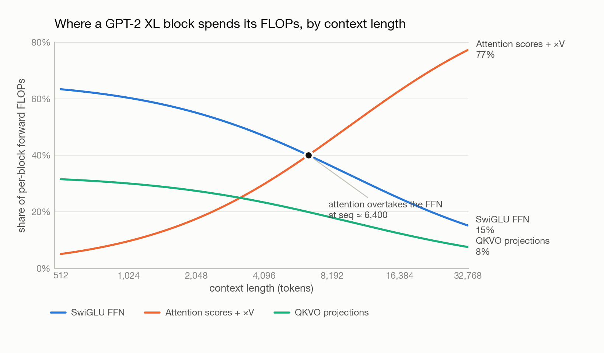

*This is Part 2 of **Building a Language Model from Scratch**. In [Part 1](../llm-from-scratch-1-tokenizer/index.qmd) we built a byte-level BPE tokenizer and found that its throughput alone puts a floor under how fast training can start. Now we count what the model itself costs.*

Take GPT-2 XL, train it the way the original paper did — 400,000 steps at batch size 1,024 — and run it on a single H100 rated at 495 TFLOP/s, achieving a respectable 50% model FLOPs utilization. That run takes **4,854 hours. About 202 days.**

Nobody trains that way, which is the point. Resource accounting is what turns "we need more GPUs" from a vibe into a number, and the numbers have a shape that is not obvious until you write them down.

# The pieces we are counting

The architecture here is a modern pre-norm decoder-only Transformer, which differs from GPT-2 as published in several ways worth naming.

**RMSNorm** replaces LayerNorm: it rescales activations by their root-mean-square without subtracting the mean, dropping the bias term and one reduction. **SwiGLU** replaces the standard two-matrix MLP with three matrices — a gate projection, an up projection multiplied elementwise by the SiLU-activated gate, and a down projection. **RoPE** replaces learned positional embeddings by rotating query and key vectors by a position-dependent angle, so attention scores depend on relative position by construction. Attention itself is standard **causal multi-head self-attention**. And the block is **pre-norm**: normalization sits inside each residual branch, leaving the residual stream itself untouched from embedding to output.

Every one of those choices earns its keep in [Part 3](../llm-from-scratch-3-training-dynamics/index.qmd). Here they only matter as things that cost FLOPs.

# 1.64 billion parameters, 6.56 GB to load

Parameter counting is arithmetic, but it is arithmetic that catches errors. For GPT-2 XL's shape — vocabulary 50,257, 48 layers, `d_model` 1,600, 25 heads, `d_ff` 4,288 — the parts are: a token embedding of `vocab × d_model`; per block, `2 · d_model` RMSNorm gains, `4 · d_model²` for the Q/K/V/output projections, and `3 · d_model · d_ff` for SwiGLU; a final RMSNorm; and an untied LM head of `vocab × d_model`.

That totals **1.64 billion trainable parameters**, or **6.56 GB** at fp32 — just to have the weights resident, before a single activation exists.

(Real GPT-2 XL is 1.5 B. The gap is SwiGLU's third matrix and the untied LM head, both of which this architecture adds.)

# Attention is not where the compute goes

Counting a matmul of shape `(m×n)·(n×p)` as `2mnp` FLOPs, and ignoring elementwise work like norms and softmax, one forward pass through one block at sequence length 1,024 breaks down like this:

| matmul | formula | FLOPs |
|---|---|---|
| Q, K, V projections | `3 · 2 · seq · d²` | 15.73 B |
| Attention scores `QKᵀ` | `2 · seq² · d` | 3.36 B |
| Attention × V | `2 · seq² · d` | 3.36 B |
| Output projection | `2 · seq · d²` | 5.24 B |
| SwiGLU FFN | `6 · seq · d · d_ff` | 42.15 B |
| **per block** | | **69.84 B** |
| × 48 layers | | 3.352 T |
| LM head | `2 · seq · d · vocab` | 164.7 B |
| **total forward pass** | | **3.52 T** |

Grouped, that is **~60% feed-forward, ~30% QKVO projections, ~10% attention proper**. The two `seq²` matmuls that everyone means when they say "attention is quadratic" are the *smallest* line item in the block.

This is a useful corrective. At GPT-2-scale context lengths, a Transformer is a stack of position-wise matrix multiplies with a comparatively cheap mixing step bolted on. If you are optimizing kernels or estimating cost, the FFN is where the money is.

As a sanity check, the rule of thumb `2 · params · tokens` gives `2 × 1.64B × 1024 ≈ 3.4` TFLOPs against our counted 3.52 — close enough to confirm the arithmetic, and a reminder that the rule of thumb is doing real work.

# Bigger models make attention matter *less*

Repeating the count for the four GPT-2 sizes, holding sequence length at 1,024:

| model | `d_model` | FFN | QKVO projections | attention scores |
|---|---|---|---|---|
| small | 768 | 54.5% | 27.3% | 18.2% |
| medium | 1,024 | 57.3% | 28.4% | 14.2% |
| large | 1,280 | 58.7% | 29.5% | 11.8% |
| XL | 1,600 | 60.3% | 30.0% | 9.6% |

Attention's share halves from small to XL. The reason is in the formulas: projections and FFN scale as `d_model²`, while the attention matmuls scale as `seq² · d_model` — only *linear* in width. Widen the model and the quadratic-in-width terms pull away.

So at fixed context length, scaling up makes attention relatively cheaper. Which is the exact opposite of the thing everyone knows about attention — and the next section is why.

# Bigger context makes attention everything

Now hold GPT-2 XL fixed and push its context length from 1,024 to 16,384.

That is a 16× increase in sequence length. It is a **38× increase in FLOPs**: 3.52 TFLOPs → **133.6 TFLOPs** for a single forward pass. The projections, FFN, and LM head all scale linearly with `seq` (×16), but the attention score and value matmuls scale with `seq²` (×256), and they drag the total past linear.

The composition inverts completely. Attention's share of a block goes from **9.6% to 63%**:

Everything the previous section said stops being true somewhere around a context length of 6,400 tokens. Below that, you are building a matmul machine and attention is a rounding error. Above it, you are building an attention machine and everything else is overhead.

This single crossover explains a decade of systems work. FlashAttention, sliding-window and sparse attention, grouped-query and multi-query attention, KV-cache quantization — none of it would be worth the complexity at context 1,024, where attention is a tenth of the budget. All of it becomes unavoidable at 16k, 128k, 1M. **Long context is not "the same model, but longer." It is a different optimization problem, and the chart above is where it changes.**

# Memory: three parameters' worth of state per parameter

FLOPs decide how long training takes; memory decides whether it runs at all. Training with AdamW in fp32 costs `4P` bytes for parameters, `4P` for gradients, and `8P` for the optimizer's first and second moments — **16 bytes per parameter**, before activations.

For GPT-2 XL that fixed cost is **26.24 GB**. Adding the activation term — the per-layer norms, projections, attention scores, and SwiGLU intermediates, which scale with batch size — gives total memory as:

`16.37 · batch_size + 26.24 GB`

On an 80 GB H100, solving `16.37 · B + 26.24 ≤ 80` gives `B ≤ 3.28`. The **maximum batch size is 3**.

Three sequences. On a flagship datacenter GPU. That is why nobody trains a 1.6 B model on one card, and why the very first thing a real training stack reaches for is mixed precision, activation checkpointing, an optimizer whose state does not cost `8P`, and — when those run out — splitting the model across devices.

Which is precisely where the [Parallelism in AI](../data-parallelism/index.qmd) series picks up: [data parallelism and FSDP](../data-parallelism/index.qmd) to shard that 26 GB of optimizer state, [pipeline parallelism](../pipeline-parallelism/index.qmd) to split the 48 layers across nodes, and [tensor parallelism](../tensor-parallelism/index.qmd) to split the individual matmuls this post spent its time counting.

*Next: [Part 3 — Training Dynamics: What Actually Moved the Loss](../llm-from-scratch-3-training-dynamics/index.qmd), in which four architecture choices get ranked by how much validation loss each one is worth.*

# References

- Zhang, B., Sennrich, R. (2019). [Root Mean Square Layer Normalization](https://arxiv.org/abs/1910.07467). *arXiv:1910.07467*
- Shazeer, N. (2020). [GLU Variants Improve Transformer](https://arxiv.org/abs/2002.05202). *arXiv:2002.05202*
- Su, J., et al. (2021). [RoFormer: Enhanced Transformer with Rotary Position Embedding](https://arxiv.org/abs/2104.09864). *arXiv:2104.09864*
- Kaplan, J., et al. (2020). [Scaling Laws for Neural Language Models](https://arxiv.org/abs/2001.08361). *arXiv:2001.08361* — the source of the `2 · params · tokens` rule of thumb.
- Dao, T., et al. (2022). [FlashAttention: Fast and Memory-Efficient Exact Attention with IO-Awareness](https://arxiv.org/abs/2205.14135). *arXiv:2205.14135*
- Loshchilov, I., Hutter, F. (2017). [Decoupled Weight Decay Regularization](https://arxiv.org/abs/1711.05101). *arXiv:1711.05101* — AdamW.
- [Stanford CS 336: Language Modeling from Scratch](https://cs336.stanford.edu/)
