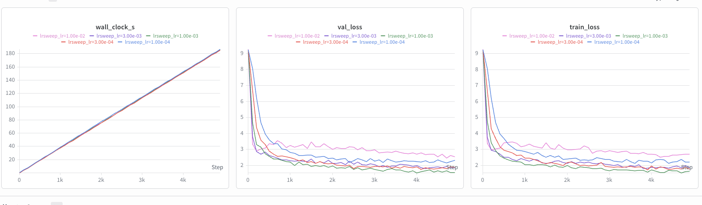
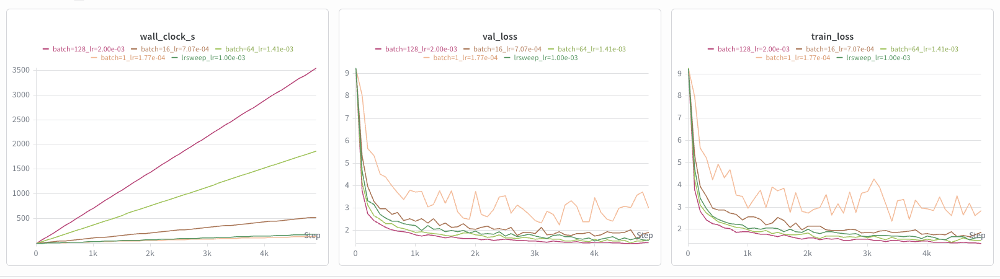
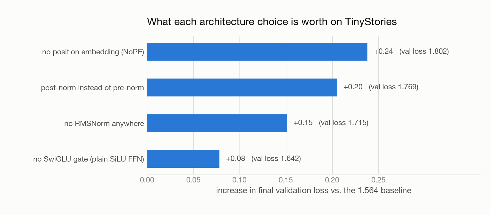
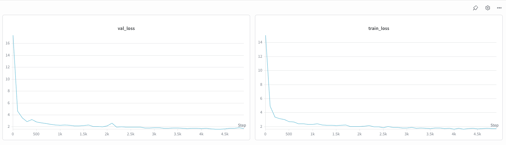
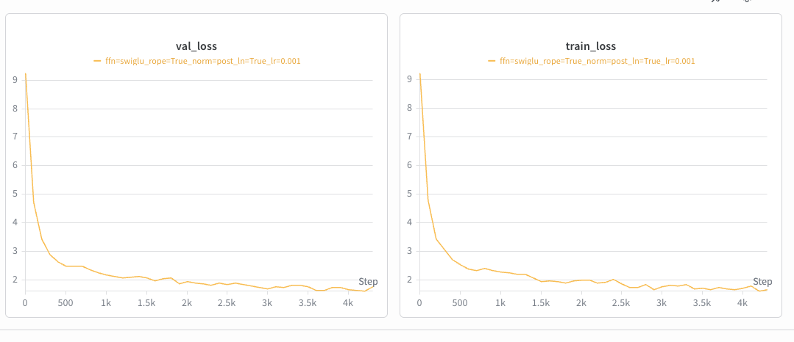
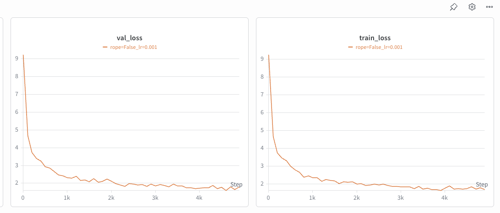
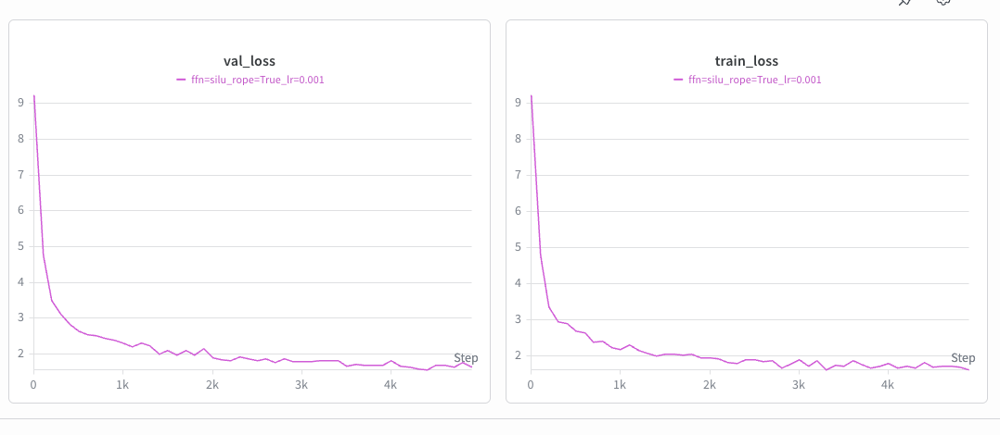

*This is Part 3 of **Building a Language Model from Scratch**. [Part 1](../llm-from-scratch-1-tokenizer/index.qmd) built the tokenizer; [Part 2](../llm-from-scratch-2-flops/index.qmd) counted the FLOPs. Now we actually train the thing and find out which of its parts matter.*

Modern Transformer blocks are a pile of accumulated decisions: pre-norm rather than post-norm, RMSNorm rather than LayerNorm, SwiGLU rather than a plain MLP, RoPE rather than learned positions. Every one is defensible from a paper. None of them tells you *how much* it is worth on your model, on your data, at your scale.

So we measured. Everything below is the same 4-layer, `d_model` 512 model on TinyStories, trained for 5,000 steps with AdamW and a cosine schedule (500 warmup steps), batch size 32. The baseline lands at **validation loss 1.564**, and every number is a delta against it.

# The learning rate sits at the edge of stability

We swept `lr_max` over a geometric grid spanning two orders of magnitude, holding everything else fixed:

| `lr_max` | final val loss |
|---|---|
| 1e-4 | 2.32 |
| 3e-4 | 1.88 |
| **1e-3** | **1.56** |
| 3e-3 | 1.86 |
| 1e-2 | 2.55 |

The curve is U-shaped, and both arms fail for different reasons. Below the optimum, training is *stable but too slow* — 1e-4 is still descending cleanly at step 5,000, it simply has not arrived. Above it, steps start overshooting: 3e-3 is visibly noisier, and 1e-2 flattens out around 2.5 and stays there.

The best rate sits directly below where things break. This is the "edge of stability" story, and its practical form is a rule: **the fastest useful learning rate is the largest one that does not degrade training.** Not the largest that survives — 1e-2 survived, in that it produced a finite loss and never NaN'd. It just trained badly. Divergence is the obvious failure; quiet degradation is the one that costs you a week.

# Batch size, and an honest caveat

Next we varied batch size from 1 to 256, scaling the learning rate as `lr = 1e-3 · √(B/32)` on the theory that lower-variance gradients tolerate — and want — bigger steps.

| batch size | `lr_max` | final val loss |
|---|---|---|
| 1 | 1.8e-4 | ≈ 2.6–3.0 |
| 16 | 7.1e-4 | 1.91 |
| 64 | 1.4e-3 | 1.58 |
| **128** | 2.0e-3 | **1.48** |
| 256 | 2.8e-3 | diverged |

Batch 1 never settles — its loss oscillates roughly between 2.6 and 3.0, so quoting a single final number would be false precision. Batch 128 gives the best result of any run in this post, 1.48.

Two caveats keep this from being "bigger batches are better."

First, **this is a fixed-*steps* comparison, not fixed-*compute***. A batch-128 step processes 128× the tokens of a batch-1 step, so a good chunk of the improvement is simply that the bigger runs did more work. The left panel of the figure makes this concrete: batch 128 took about 3,500 seconds where the baseline took under 200. Under a fixed *time* budget — which is exactly the constraint in [Part 4](../llm-from-scratch-4-leaderboard/index.qmd) — the ranking changes.

Second, the √-scaling rule **overshot at 256**. It worked for three doublings and then handed us a learning rate that diverged. Batch-size scaling laws are heuristics that need re-tuning at their edges, not formulas you can extrapolate.

# The ablation ranking

Now the centerpiece. Four components, removed one at a time, each trained with the identical recipe:

| removed | val loss | Δ vs baseline |
|---|---|---|
| RoPE → NoPE (no positional information) | 1.802 | +0.24 |
| pre-norm → post-norm | 1.769 | +0.21 |
| RMSNorm → none | 1.715 | +0.15 |
| SwiGLU → plain SiLU FFN | 1.642 | +0.08 |

The ordering is the interesting part. **Positional information and residual-stream design each cost roughly three times what the FFN's gating mechanism does.** SwiGLU is the change people talk about most — it is a named architectural feature with a paper behind it — and at this scale it is the smallest effect of the four. Meanwhile pre-norm, which is close to a formatting detail in how you write the block, is worth 0.21.

One methodological note on the SwiGLU comparison: swapping the gated FFN (`d_ff` 1,344, three matrices) for a plain SiLU FFN (`d_ff` 2,048, two matrices) keeps parameter count nearly identical — about 2.06 M vs 2.10 M per block. So the +0.08 is attributable to gating itself, not to a smaller model.

# The two results worth dwelling on

The headline numbers are less interesting than two things that happened around them.

**Removing all normalization did not destabilize training.** We expected the no-RMSNorm run to need a lower learning rate; textbook framing is that normalization is what keeps deep networks trainable. It trained fine at the baseline 1e-3 and simply landed 0.15 worse. What normalization bought here was *quality*, not survival.

The one place instability shows is at initialization. The no-norm run starts from a validation loss around **17**, where a well-scaled random init should start near `ln 10,000 ≈ 9.2` — the entropy of a uniform distribution over the vocabulary. Without RMSNorm the activation magnitudes at init are simply wrong, and the first few hundred steps get spent fixing that instead of learning. Normalization is doing real work; at four layers, that work is worth 0.15 rather than the difference between training and not.

**NoPE degrades but does not collapse.** Self-attention is permutation-invariant, so with no positional signal at all the model should not be able to distinguish "dog bites man" from "man bites dog". It should be much worse than +0.24.

The reason it is not: **causal masking leaks position**. Token *i* attends to exactly *i* previous tokens, so the size of each position's visible prefix is itself a positional signal, and a decoder-only model can learn to read it. This is why NoPE results exist in the literature at all, and it is a genuinely non-obvious property of decoder-only architectures — encoder models with bidirectional attention have no such fallback.

::: {.callout-note collapse="true"}
## Individual ablation curves

Each ablation run on its own axes, from the Weights & Biases sweep. The comparison against baseline is the table and chart above; these show that every ablated variant trained cleanly to convergence rather than falling over.

The no-RMSNorm run is the one to look at — note the y-axis starting near 17 rather than 9.

:::

# What 1.5 nats of loss sounds like

Numbers are abstract; here is the baseline model, prompted with "Once upon a time" at temperature 0.8 and top-p 0.9, sampling to the first end-of-text token:

> Once upon a time, there was a beautiful fairy. She lived in a big, pretty garden. The fairy had a pretty garden with many flowers. She liked to look at the flowers and the bugs. One day, the fairy met a boy. The boy was deaf. He could not hear her. The fairy wanted to help the boy. She said, "Please let me play with you. I will teach you how to be nice." The boy was happy. He started to play with the fairy. They played and had fun. The fairy and the boy became good friends. They played together every day. And they lived happily ever after.

That is a 4-layer model, trained for under four minutes. It is grammatical, correctly punctuates dialogue, keeps a consistent cast, and produces a complete arc — setup, complication, resolution, ending — then stops on its own. The repetition ("a pretty garden with many flowers", right after "a big, pretty garden") is the tell, and so is the fact that the boy's deafness is introduced and then quietly dropped.

Decoding parameters change the character of the failure more than its severity. At temperature 0.1 the model collapses toward greedy decoding and repeats itself outright. At 1.0 it invents freely and loses the thread — non-sequiturs, characters that appear once. Temperature 0.8 with top-p 0.9 is the setting where diversity and coherence are both tolerable, and it is what produced the sample above.

The honest framing is that TinyStories is a narrow, regular distribution, and a small model can fit it well. The next post is what happens when the data stops cooperating.

*Next: [Part 4 — 45 Minutes on a B200](../llm-from-scratch-4-leaderboard/index.qmd), in which a fixed wall-clock budget turns training into a throughput problem and the biggest lever turns out not to be the architecture.*

# References

- Zhang, B., Sennrich, R. (2019). [Root Mean Square Layer Normalization](https://arxiv.org/abs/1910.07467). *arXiv:1910.07467*
- Xiong, R., et al. (2020). [On Layer Normalization in the Transformer Architecture](https://arxiv.org/abs/2002.04745). *arXiv:2002.04745* — the pre-norm vs. post-norm analysis.
- Shazeer, N. (2020). [GLU Variants Improve Transformer](https://arxiv.org/abs/2002.05202). *arXiv:2002.05202*
- Su, J., et al. (2021). [RoFormer: Enhanced Transformer with Rotary Position Embedding](https://arxiv.org/abs/2104.09864). *arXiv:2104.09864*
- Haviv, A., et al. (2022). [Transformer Language Models without Positional Encodings Still Learn Positional Information](https://arxiv.org/abs/2203.16634). *arXiv:2203.16634* — why NoPE works at all.
- Holtzman, A., et al. (2019). [The Curious Case of Neural Text Degeneration](https://arxiv.org/abs/1904.09751). *arXiv:1904.09751* — top-p sampling.
- Cohen, J., et al. (2021). [Gradient Descent on Neural Networks Typically Occurs at the Edge of Stability](https://arxiv.org/abs/2103.00065). *arXiv:2103.00065*
- [Stanford CS 336: Language Modeling from Scratch](https://cs336.stanford.edu/)
