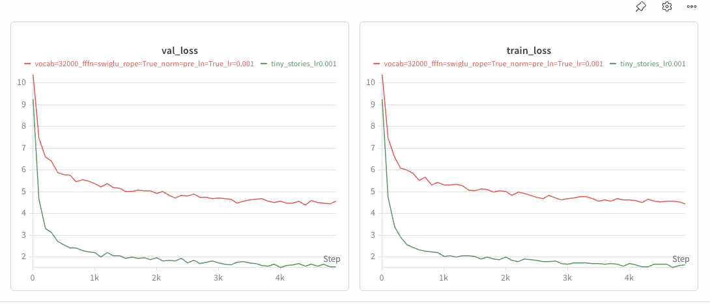
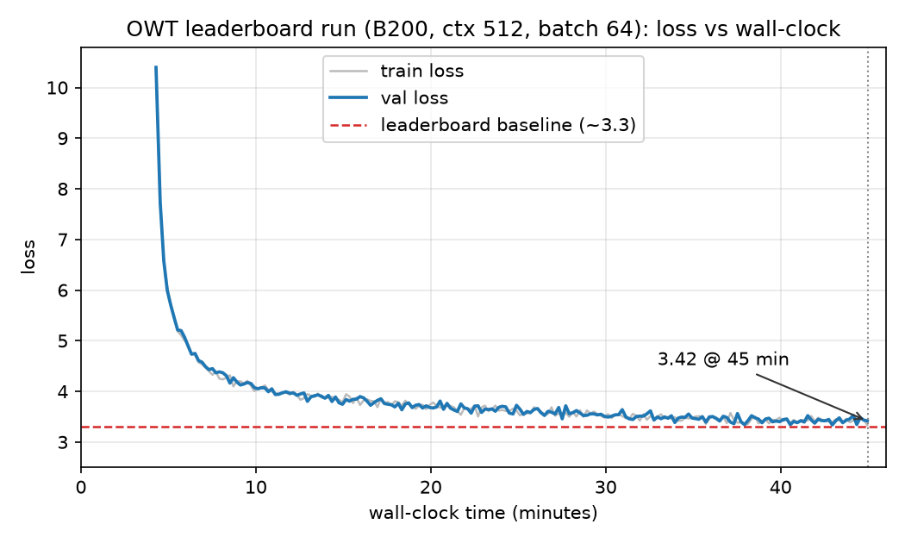

*This is the last part of **Building a Language Model from Scratch**. [Part 1](../llm-from-scratch-1-tokenizer/index.qmd) built the tokenizer, [Part 2](../llm-from-scratch-2-flops/index.qmd) counted the FLOPs, [Part 3](../llm-from-scratch-3-training-dynamics/index.qmd) ranked the architecture choices. This one throws a stopwatch at all of it.*

Every experiment so far ran for a fixed number of steps. That is the right way to isolate a variable, and it is not how anyone actually trains. Real training runs have a budget, and the budget is time.

The leaderboard task changes the objective to exactly that: **one B200, at most 45 minutes wall clock, OpenWebText only, validated at context length 512 with the 32k vocabulary.** Minimize validation loss. The public baseline to beat is around 3.3; competitive entries sit near 3.0.

The single most useful thing this taught us: under a time budget, the biggest lever was not architectural at all.

# The naive attempt, and why it failed twice

The obvious starting point is the model from Part 3 — 4 layers, `d_model` 512 — pointed at OpenWebText instead of TinyStories.

It reached roughly **4.5** validation loss and stopped improving. That is nowhere near 3.3.

It also failed a second time, more embarrassingly: it was validated at context length 256, not the required 512. Loss depends on how much context each prediction gets to condition on, so a number measured at 256 is not comparable to a leaderboard measured at 512. Worth stating plainly, because it is the kind of mistake that produces a confident wrong answer rather than an error message.

The model was simply too small for the data. TinyStories is narrow and regular; OpenWebText is scraped web text spanning every topic, register, and formatting convention on the internet. A 4-layer model can memorize the first and can only smear itself thinly across the second.

# Scaling up

The fix was to stop being clever and build a GPT-2-small-shaped model:

- 12 layers, `d_model` 768, 12 heads, `d_ff` 2,048 — about **134 M parameters**
- Pre-norm blocks with SwiGLU, RoPE, and RMSNorm — i.e. every ablation from Part 3, all of which we now know are worth keeping
- Context length 512, OpenWebText's 32k vocabulary
- AdamW, cosine schedule with 1,000 warmup steps, gradient clipping at ℓ2-norm 1.0, `lr_max` 8e-4, batch size 64

Nothing exotic. Under a time budget, a bigger well-understood model beats a smaller model with a clever modification, because the clever modification has to be debugged and the budget does not care.

# The lever was data loading

This is the part worth generalizing from.

We did the expected throughput work: `torch.compile` for kernel fusion, `bfloat16` autocast, TF32 matmuls via `set_float32_matmul_precision("high")`, and memory-mapped `uint16` streaming so batches come out of the page cache rather than a Python loop. All of it helped.

Then we changed batch size from 32 to 64 and got **≈2.2× the tokens per second**.

A 2× batch increase should not give a 2.2× throughput increase. That it did means the run was not compute-bound at batch 32 — it was bound on overhead and data loading, with the GPU idling between batches. Doubling the batch amortized that fixed per-step cost across twice the work, and the B200 finally got to do what it is for.

That one change is what let ~0.7 B tokens fit into 45 minutes. It was worth more than any architectural decision in this post, and we found it by looking at tokens/second rather than at loss.

The general lesson: **before optimizing the model, check whether the accelerator is actually busy.** [Part 2](../llm-from-scratch-2-flops/index.qmd) counted FLOPs on the assumption that FLOPs are the constraint. Under a wall-clock budget on a very fast GPU, they frequently are not — the data path is.

# The result, stated honestly

At the 45-minute mark: **3.42**. The best single-batch estimate during the run was 3.34, and the measurement fluctuates between roughly 3.34 and 3.47.

Some care with that number is warranted, so:

- It is a **single-batch estimate**, not a full validation-set pass. A complete pass would give a cleaner, less noisy figure, and it is the number we would report if the budget allowed it.
- 3.42 is *at* the ~3.3 baseline, not comfortably past it, and not in the ~3.0 competitive range.
- The improvement over the small model is real and large — roughly 4.5 → 3.4 — but it came from scaling to a known-good configuration, which is the least surprising possible way to improve a result.

The obvious next moves would be batch 128, which is still throughput-limited by data loading, and budgeting the step count so that `torch.compile`'s warmup plus training finish comfortably inside 45 minutes rather than right at the edge.

# Why the TinyStories number is not the comparison

It is tempting to put Part 3's 1.5 next to this post's 3.4 and conclude something about the model. That comparison is meaningless, for two reasons.

**The entropy floors are different.** Loss is measured in nats per token, and a random-initialized model sits at the log of the vocabulary size: `ln 10,000 ≈ 9.2` for TinyStories, `ln 32,000 ≈ 10.4` for OpenWebText. The two runs start from different places and are measured against different-sized prediction problems. You can see both starting points in the figures above.

**The data is differently predictable.** TinyStories is generated text with a constrained vocabulary and repetitive structure — genuinely low-entropy. OpenWebText is the open internet. Cross-entropy measures how surprising the data is under the model, so a higher number on harder data is not a worse model; it may be a much better one.

Comparing loss across tokenizers or corpora is one of the easier ways to fool yourself in this field. The only fair comparisons in this series are the ones inside a single dataset and vocabulary.

# The infrastructure that made the sweeps possible

None of Part 3's experiments would have happened at this pace without a bit of plumbing, and it is the most reusable thing here.

Training runs execute on **[Modal](https://modal.com/)**, which gives per-run cloud GPUs from a Python decorator, with the pre-tokenized arrays on a persistent volume so nothing re-uploads. Logging goes to **[Weights & Biases](https://wandb.ai/)** — train loss, validation loss, and wall-clock time every 100 steps, with the full model and optimizer config captured at init so a run is reconstructable months later.

The piece that mattered most was the sweep pattern. Each experiment is a local entrypoint that loops over hyperparameter values and calls `train.spawn(...)` per setting, so the whole learning-rate sweep launches as five concurrent GPU jobs instead of five sequential ones. The five-point LR sweep and the five-point batch-size sweep in Part 3 each cost about as much wall clock as a single run. When experiments are cheap to fan out, you run the sweep instead of guessing the hyperparameter — and that is the actual difference between having an opinion about learning rates and having a chart.

That is the series: a tokenizer that is really a compression algorithm, a FLOP budget that inverts as context grows, four architecture choices ranked by what they are worth, and a training run whose bottleneck turned out to be the disk. The parts everyone talks about are rarely the parts that decide the outcome.

*The full experiment log for these runs is on [Weights & Biases](https://wandb.ai/rohan0401/cs336-tinystories/reports/Experiment-Log--VmlldzoxNzUyMDYxMw).*

# References

- Radford, A., et al. (2019). [Language Models are Unsupervised Multitask Learners](https://cdn.openai.com/better-language-models/language_models_are_unsupervised_multitask_learners.pdf) — the GPT-2 architecture this run copies.
- Gokaslan, A., Cohen, V. (2019). [OpenWebText Corpus](https://skylion007.github.io/OpenWebTextCorpus/)
- Micikevicius, P., et al. (2017). [Mixed Precision Training](https://arxiv.org/abs/1710.03740). *arXiv:1710.03740*
- Ansel, J., et al. (2024). [PyTorch 2: Faster Machine Learning Through Dynamic Python Bytecode Transformation and Graph Compilation](https://pytorch.org/assets/pytorch2-2.pdf) — `torch.compile` and TorchInductor.
- Hoffmann, J., et al. (2022). [Training Compute-Optimal Large Language Models](https://arxiv.org/abs/2203.15556). *arXiv:2203.15556* — on spending a fixed budget between model size and tokens.
- [Stanford CS 336: Language Modeling from Scratch](https://cs336.stanford.edu/)
